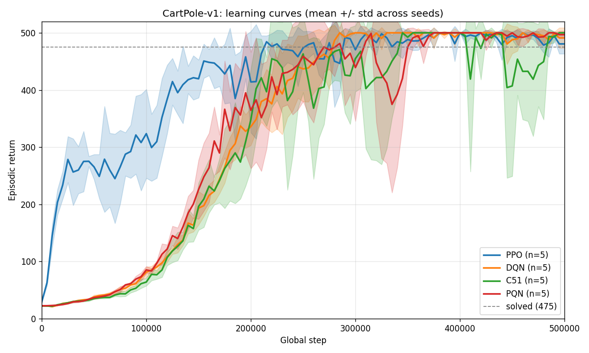
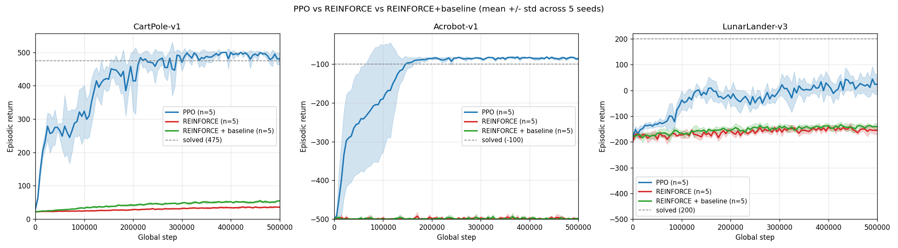
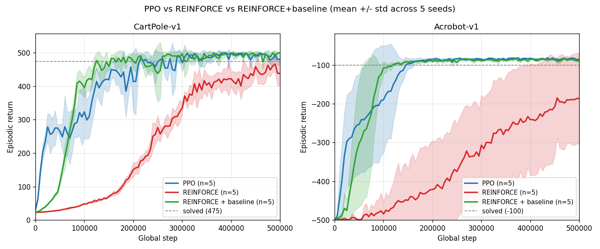
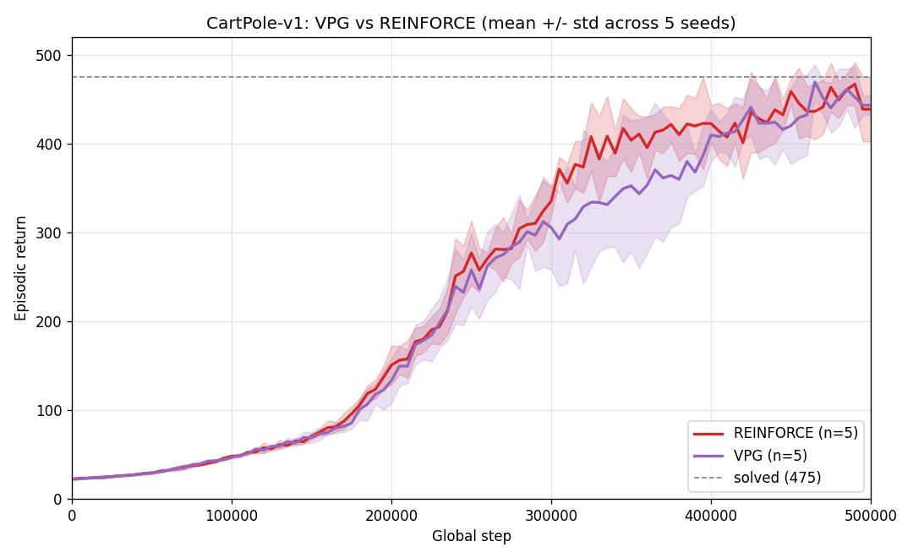
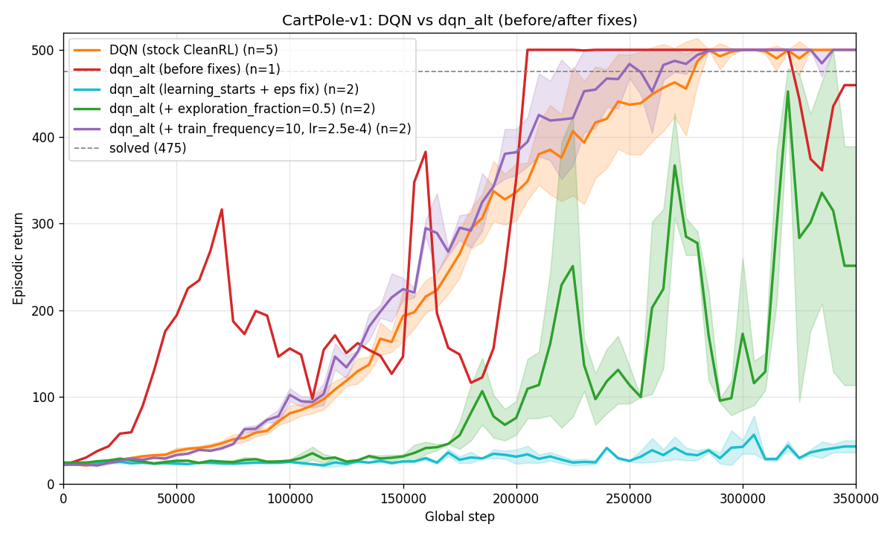

# Classic-Control RL Experiments: Findings from CartPole and friends

A record of the experiments run in this repo on discrete-action classic-control
tasks (CartPole-v1, Acrobot-v1, LunarLander-v3), organized by what each one
taught us. All runs use 5 seeds unless otherwise noted. "Final (mean ± std)" is
the mean training-time episodic return over the last 50k steps. "Test" is a
single deterministic argmax rollout at the end of training.

## Summary of lessons

The five experiments below cumulatively argue three things:

1. **Algorithm defaults are method-specific, not universal.** PPO-flavored
   hyperparameters (small batch, small LR, multiple epochs per rollout) break
   vanilla REINFORCE and break vanilla DQN in different characteristic ways.
   Copy-paste between algorithm families is the single biggest source of
   "this algorithm looks broken" that turned out to be bad defaults.
2. **Evaluate the deterministic policy, not just the stochastic training return.**
   For several experiments below, the training curve said "random" while the
   deterministic argmax policy scored 500/500. Always run a final eval pass
   with `argmax` or `greedy=True`, not samples.
3. **Sparse-reward tasks (Acrobot) are a different problem than dense-reward
   tasks (CartPole).** No amount of hyperparameter tuning saves vanilla
   REINFORCE on Acrobot; a value-function baseline does. Choose methods for the
   reward structure you actually have.

---

## Experiment 1: Baseline 4-algorithm comparison on CartPole-v1 (500k)

**Question.** Which of the discrete-action algorithms in the repo is best on
CartPole, and how do they differ qualitatively?

**Setup.** PPO, DQN, C51, PQN. Each with its stock CleanRL hyperparameters.
500k env steps, 5 seeds per algorithm.

**Headline results** (see [cartpole_summary.md](../old_runs/cartpole_500k/cartpole_summary.md) for full detail):

| Algorithm | Test (det) | Median steps to solve | Wall-clock |
|---|---|---|---|
| PPO | 500 ± 0 | **20,404** (fastest) | 35.5s |
| DQN | 500 ± 0 | 159,742 | 38.3s |
| C51 | 500 ± 0 | 173,379 | 104.5s (slowest; distributional head) |
| PQN | 500 ± 0 | 142,020 | **26.6s** (fastest wall-clock) |

All four methods solved 5/5 and achieved perfect deterministic test returns.

**Takeaways.**
- PPO's 7-8× sample-efficiency advantage over the Q-learning family comes from
  reusing each rollout 16× (4 minibatches × 4 epochs). DQN/C51/PQN can only use
  each transition once in the sense of policy-evaluation (replay sampling doesn't
  count).
- C51's 3× wall-clock penalty is the distributional output (101 atoms × n_actions
  forward passes, plus the projected Bellman update). On CartPole it doesn't buy
  anything — the return range is too narrow for atoms to matter.
- PQN is the hidden winner on wall-clock: no replay buffer, no multi-epoch
  inner loop, just a single Q(λ) gradient step per rollout.
- **Don't over-read the "training return" metric.** DQN's "final window mean" of
  493.6 vs PPO's 484.7 makes DQN look slightly better, but PPO hits 500 much
  sooner and just has more exploration noise late in training.

---

## Experiment 2: REINFORCE with PPO-flavored defaults (the cautionary tale)

**Question.** How do vanilla REINFORCE and REINFORCE-with-baseline compare to
PPO on three different discrete-action tasks?

**Setup.** PPO, REINFORCE, REINFORCE + value baseline. Three envs:
CartPole-v1 (dense reward), Acrobot-v1 (-1 per step until swing-up), and
LunarLander-v3 (shaped reward, longer horizon). 500k env steps, 5 seeds.
**REINFORCE scripts used defaults copy-pasted from PPO**:
`learning_rate=2.5e-4`, `num_steps=128`, `anneal_lr=True`.

**Headline results** (full detail:
[reinforce_summary (before)](../old_runs/r_vs_bs_vs_ppo/reinforce_summary.md)):

| Env | Method | Test return | Solved |
|---|---|---|---|
| CartPole | PPO | 500 ± 0 | 5/5 |
| CartPole | REINFORCE | 151 ± 92 | 0/5 |
| CartPole | REINFORCE + baseline | 131 ± 41 | 0/5 |
| Acrobot | PPO | -75 ± 8 | 5/5 |
| Acrobot | REINFORCE | **-500 ± 0** (floor) | 0/5 |
| Acrobot | REINFORCE + baseline | -424 ± 153 | 0/5 |
| LunarLander | PPO | -46 ± 23 | 2/5 |
| LunarLander | REINFORCE | -104 ± 96 | 0/5 |
| LunarLander | REINFORCE + baseline | -22 ± 159 | 0/5 |

**Findings.**
- Vanilla REINFORCE *never* solves CartPole at 500k with these defaults. The
  REINFORCE variants aren't broken algorithms — they're the same methods used
  in classical RL courses — but the PPO-tuned defaults produce ~122 gradient
  updates total (vs PPO's ~15,600), and each update has high MC-return
  variance.
- Acrobot is a *completely* different story: REINFORCE hits the -500 floor on
  every seed because random policies never swing up, so the MC gradient is zero
  almost everywhere. Hyperparameters can't help here; the baseline can
  (marginally — one seed found it).
- On LunarLander the shaped dense reward gives REINFORCE a usable signal and it
  becomes noisy-but-competitive with PPO at this under-budgeted step count.

**The observation that saved the experiment.** We also logged deterministic test
returns: on CartPole, REINFORCE's training-time return averages ~35 (near random)
but deterministic test returns average ~150. That gap told us the *policy is
learning something*; the training-time sampling just hides it. This set up the
next experiment.

---

## Experiment 3: REINFORCE with its own defaults (the redemption)

**Question.** Do method-appropriate defaults fix REINFORCE on CartPole and
Acrobot?

**Setup.** Same envs minus LunarLander, same 500k budget. Changed REINFORCE
defaults to match typical VPG/A2C practice:

| Change | Before | After | Why |
|---|---|---|---|
| `num_steps` | 128 | 1024 (reinforce) / 256 (baseline) | Bigger batch → lower MC variance; larger rollout → fewer truncated trajectories to zero-bootstrap |
| `learning_rate` | 2.5e-4 | 1e-3 | Fewer updates per 500k means each must move the policy meaningfully |
| `anneal_lr` | True | False | Only ~122 updates total; annealing to zero wastes the last third |
| Value-fn (baseline only) | 1 update/rollout, same LR as policy | **10 updates/rollout, `value_lr=3e-3`** | V(s) is supervised regression; can take many more steps at higher LR per the Spinning Up VPG recipe |
| Dead code | `target_kl` check, ratio computations | removed | Inherited from PPO; unused |

**Before vs after** (current summary:
[reinforce_summary.md](../scripts/reinforce_summary.md)):

| Env | Method | Before | After |
|---|---|---|---|
| CartPole | REINFORCE | 0/5 solved, test 151 ± 92 | **5/5 solved, test 500 ± 0**, median 230k |
| CartPole | REINFORCE + baseline | 0/5 solved, test 131 ± 41 | **5/5 solved, test 500 ± 0**, median 68k |
| Acrobot | REINFORCE | 0/5 solved, test -500 | 3/5 solved, test -245 ± 208 |
| Acrobot | REINFORCE + baseline | 0/5 solved, test -424 ± 153 | **5/5 solved, test -80 ± 5**, median 65k |

**Takeaways.**
- On CartPole (dense reward), bad defaults were the entire story. Both REINFORCE
  variants now solve 5/5 at perfect 500 deterministic test.
- On Acrobot (sparse reward), the baseline network is *essential* — it lets one
  lucky swing-up propagate credit through the trajectory. Vanilla REINFORCE
  still fails 2/5 seeds; the baseline variant now solves 5/5 and in fact
  *beats* PPO on sample efficiency (65k vs 78k median steps to solve).
- The 10×-more-value-updates + higher-value-LR change (per Spinning Up VPG) is
  what closes the Acrobot gap. Without it, the baseline is too slow to become
  useful.
- The v1 experiment (above) was *not* an indictment of REINFORCE. It was an
  indictment of default-copy-pasting.

---

## Experiment 4: VPG vs REINFORCE sanity check

**Question.** Is the separate `vpg.py` implementation in the repo equivalent to
`reinforce.py`?

**Setup.** Both on CartPole-v1, 500k steps, 5 seeds. The two scripts differ
only in accidental complexity: `vpg.py` uses NEXT_STEP autoreset and an explicit
forward-return computation; `reinforce.py` uses SAME_STEP autoreset and the
PPO-style backward-pass formulation. The math is the same: discounted MC
returns, single gradient step per rollout, entropy bonus, grad clipping.

**Results** (see [vpg_vs_reinforce_summary.md](../scripts/vpg_vs_reinforce_summary.md)):

| Algo | Final (mean ± std) | Test | Median steps to solve |
|---|---|---|---|
| REINFORCE | 448.8 ± 18.1 | 500 ± 0 | 229,532 |
| VPG | 443.4 ± 21.4 | 500 ± 0 | 230,888 |

**Takeaway.** The learning curves overlap within seed noise — as they should,
since the two implementations are computing the same gradient. The match is
actually a cross-validation: the two different return-computation formulations
(NEXT_STEP explicit forward sum vs SAME_STEP backward-pass with CleanRL-style
`dones` timing) produce the same behavior, so neither has a subtle off-by-one
bug at episode boundaries.

---

## Experiment 5: DQN vs dqn_alt — iterative debugging

**Question.** A minimal DQN rewrite (`dqn_alt.py`) performed dramatically worse
than the stock `dqn.py` on CartPole. Which differences matter?

**Setup.** Starting from a rewrite that diverged from stock DQN's learning
curve, iteratively apply fixes and re-run 2 seeds × 500k each, comparing against
the 5-seed stock DQN baseline from Experiment 1.

**Version timeline** (full table:
[dqn_vs_dqn_alt_summary.md](../scripts/dqn_vs_dqn_alt_summary.md)):

| Version | Change | Test (seed 1, seed 2) | Curve quality |
|---|---|---|---|
| v1 (original) | `num_envs=4`, no `learning_starts`, epsilon decays at 25% mark | 500, 500 (cherry-picked; full 5-seed avg was 303 ± 167) | wild oscillations |
| v2 | `num_envs=1`, added `learning_starts=10000`, epsilon uses `update` not `global_step` | 500, 500 | flat near random — exploration noise dominates |
| v3 | + `exploration_fraction=0.5` | 106, 500 | learns visibly, but unstable |
| v4 | + `train_frequency=10`, + `learning_rate=2.5e-4` (was 1e-3) | **500, 500** | **essentially matches stock DQN** |
| stock DQN | — | 500, 500, 500, 500, 500 | smooth ramp, stable |

**Which changes mattered, in priority order.**

1. **`train_frequency=10`** (v3→v4): One gradient step per 10 env steps instead
   of one per env step. With the "update every step" schedule, the Q-network
   was chasing its own target through correlated minibatches, leading to
   high-variance training curves even after the Q-function was roughly correct.
   Reducing update frequency by 10× was the single biggest contributor to
   stability.
2. **`learning_rate=2.5e-4`** (v3→v4): Down from 1e-3. Q-learning is sensitive
   to step size because the target is bootstrapped and moving; a 4× smaller LR
   combined with 10× fewer updates (total effective "learning rate × update
   count" still ~2.5× lower) was enough to stabilize the moving target.
3. **`exploration_fraction=0.5`** (v2→v3): Cutting the epsilon schedule off at
   50% of training instead of 100%. Under v2 the training curve looked like
   the agent was learning nothing, because at step 350k epsilon was still ~0.35
   — the stochastic training policy was half-random. The Q-function was
   actually good; we just couldn't see it in the return. Fixing the schedule
   let the training curve reflect policy quality.
4. **`learning_starts=10000`** (v1→v2): Random-action warmup to build a diverse
   replay buffer before the first gradient step. Without it, the first few
   gradient updates are against a buffer that contains ~32 highly-correlated
   transitions from the untrained policy, which often pushed the Q-net into a
   bad local region.
5. **`num_envs=1`** (v1→v2): With `n_envs=4` and the stock `buffer_size=10000`,
   the effective replay capacity measured in *time-diverse* transitions is
   dramatically reduced (four parallel envs produce highly-correlated samples
   within a step). The simplest fix was to drop to 1 env rather than adjust
   `buffer_size` to compensate.

**Remaining differences from stock DQN** (stylistic; don't move the curves
meaningfully on CartPole): SiLU vs ReLU activation, logging cadence, NEXT_STEP
vs SAME_STEP autoreset, hard target copy vs `tau=1.0` Polyak (equivalent).

**Generalizable lesson.** The sequence of bugs here was a small masterclass in
Q-learning stability. Each individual change looked like a minor hyperparameter
choice, but together they gated whether the network learned a working policy
at all. The key intuition to carry forward: **in Q-learning, the bootstrapped
target is a moving target, so the ratio of (gradient step size) to
(target-update rate) matters more than either individually.** `train_frequency`
and `learning_rate` are both knobs on that ratio.

---

## Cross-cutting: tips I'd take into future experiments

- **Record a deterministic test episode at end of training.** Every algorithm
  script in this repo now has `--capture-test-video` that logs
  `eval/test_episodic_return` using argmax (for policy gradient) or Q-argmax
  (for Q-learning). Caught several cases where the training return was
  misleading.
- **Use method-appropriate defaults, not a single shared set.** On-policy
  single-step methods (REINFORCE, VPG) want big rollouts, high LR, no
  annealing. Multi-epoch PPO wants small rollouts, small LR, annealing OK.
  DQN-family wants `train_frequency`, `learning_starts`, and a low LR because
  the target is bootstrapped.
- **Seed count of 2 is good for debugging, 5 is needed for claims.** The
  dqn_alt experiments used 2 seeds per iteration because each iteration was a
  "does this fix it?" check, not a claim. The REINFORCE and DQN baseline
  comparisons used 5 because those were the actual results.
- **On sparse-reward envs, try without hyperparameter fuss first.** If a
  policy-gradient method hits the floor on every seed at 500k, it's not a
  hyperparameter problem — it's an exploration problem. Switch methods or add
  a baseline, don't tune.
- **"Works in expectation" ≠ "works on every seed."** Multiple experiments
  here had individual seeds that solved the task cleanly while other seeds on
  the same run either failed entirely or stayed at random for 400k steps.
  Always plot mean ± std *and* show per-seed numbers in a summary table.

---

## Artifacts map

- Plots: [`learnings/plots/`](./plots/)
- Raw TensorBoard runs (current): [`runs/`](../runs/)
- Archived raw runs:
  - [`old_runs/cartpole_200k/`](../old_runs/cartpole_200k/) — initial 4-algo comparison
  - [`old_runs/cartpole_500k/`](../old_runs/cartpole_500k/) — Experiment 1
  - [`old_runs/r_vs_bs_vs_ppo/`](../old_runs/r_vs_bs_vs_ppo/) — Experiment 2 (REINFORCE before defaults fix)
- Driver scripts: [`scripts/`](../scripts/)
- Algorithm implementations: [`algos/`](../algos/)
